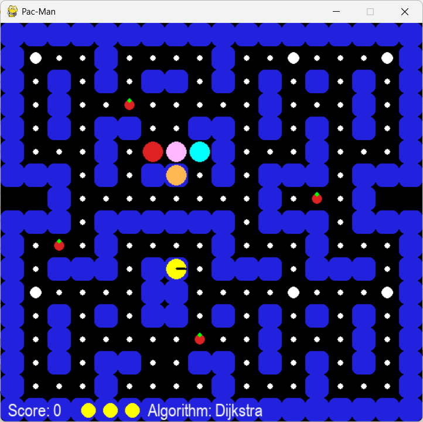
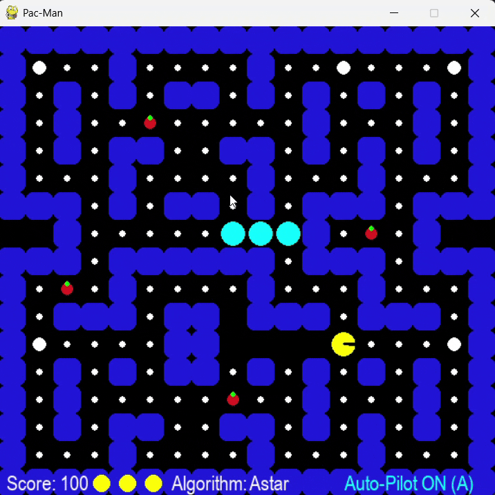
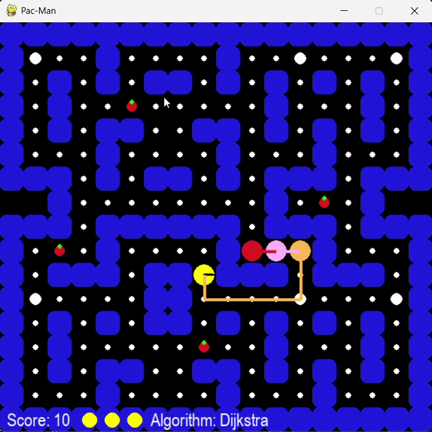

# 🟡 Pac-Man Game using Dijkstra and A* Algorithm

A 2D reimagining of the classic **Pac-Man** game developed in **Python (Pygame)**, featuring advanced ghost AI that uses **Dijkstra’s** and **A\*** pathfinding algorithms to chase the player intelligently.

## 🎯 Features

- 🧠 Ghosts powered by **Dijkstra** or **A\*** algorithms for optimal pathfinding  
- 🎮 Real-time gameplay with **Pygame**  
- 🌀 Power-ups like speed boosts, teleportation, and invisibility *(coming soon)*  
- 🎨 Clean grid-based movement with animation and sound effects  
- 🧱 Wall and node-based map structure for flexible level design  

## 📸 Preview

 <!-- Add a screenshot here if available -->

### 🎮 Pac-Man Auto-Pilot Mode
Pac-Man finds and follows the shortest path to the nearest pellet using A* or Dijkstra.



### 🎮 Ghost Auto-Pilot Mode
Ghosts find and follow the shortest path to the nearest pellet using A* or Dijkstra.



## 🛠️ Technologies Used

- Python 3.x  
- Pygame  
- NetworkX (for graph-based pathfinding logic)  

## 🚀 Getting Started

### Prerequisites

Make sure Python and Pygame are installed:

```bash
pip install pygame networkx
```

### Clone the Repository

```bash
git clone https://github.com/Paarth01/PacMan-Game-using-Dijkstra-and-Astar-algorithm.git
cd PacMan-Game-using-Dijkstra-and-Astar-algorithm
```

### Run the Game

```bash
python main.py
```

## 🧭 Pathfinding Algorithms

### ✅ Dijkstra’s Algorithm

Used for finding the **shortest path** from the ghost to the player regardless of heuristics. Suitable for uniform-cost maps.

### ⭐ A\* (A-Star) Algorithm

An optimized version of Dijkstra’s that uses **heuristics** (like Manhattan distance) for **faster decision-making**.

You can toggle between the two algorithms in the game or code by selecting the desired function in the ghost AI logic.

## 📂 Project Structure
```bash
PacMan-Game-using-Dijkstra-and-Astar-algorithm/
│
├── astar.py               # A* pathfinding algorithm
├── dijkstra.py            # Dijkstra's pathfinding algorithm
├── main.py                # Main game loop and initialization
├── README.md              # Project overview and instructions
├── LICENSE                # GPL-3.0 License
└── .gitignore             # Git ignore file
```

## 🧩 Planned Features

- ⏩ Speed boost, invisibility, and teleportation power-ups  
- 🗺️ Multiple levels and dynamic map generation  
- 🎵 Sound effects and background music  
- 🎨 Improved animations and UI elements  

## 🤝 Contributing

Contributions are welcome! If you have ideas for features, bug fixes, or optimizations:

1. Fork the repository  
2. Create a new branch: `git checkout -b feature-name`  
3. Commit your changes: `git commit -m 'Add new feature'`  
4. Push to the branch: `git push origin feature-name`  
5. Open a pull request  

## 📜 License

This project is licensed under the [GNU General Public License v3.0](LICENSE).

## 🙌 Acknowledgements

- Classic **Pac-Man** by Namco for inspiration  
- Community tutorials on A\* and Dijkstra  
- Open-source sprite and sound libraries  

---

⭐ Star this repo if you liked the project!  
📬 Feel free to reach out for collaboration or suggestions!
